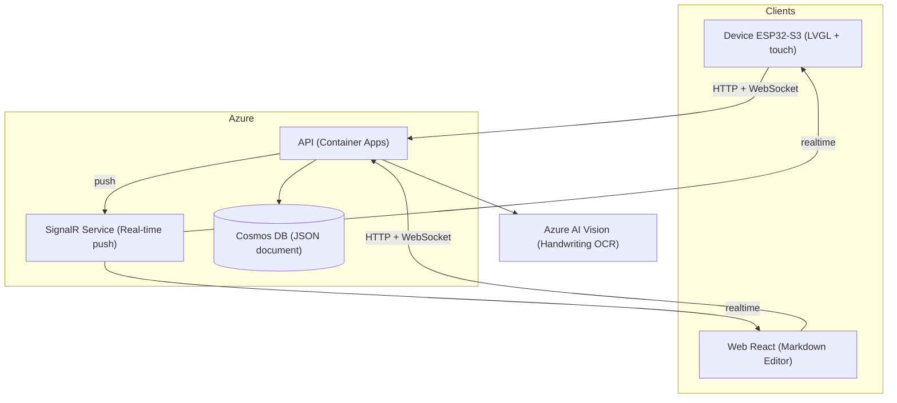

# 3. System Architecture

## 3.1 Main Components

- **Device (ESP32-S3):** renders the UI in LVGL, captures the writing stroke, crops the written region, and sends it via HTTPS to the API when the user confirms (debounce). Maintains a WebSocket connection to receive changes made on the web.
- **Web (React):** simple Markdown editor with preview. Visuals subtly inspired by a notebook (fonts), without replicating the device's full skeuomorphism.
- **API (Azure Container Apps / Node.js):** single entry point. Receives images for OCR, exposes document CRUD operations, acts as an authenticated proxy for Azure AI Vision.
- **SignalR Service:** real-time push layer, avoiding the complexity of an MQTT broker.
- **Cosmos DB (serverless):** stores the single "notebook" document in JSON.
- **Azure AI Vision:** cloud OCR engine, with handwritten text support.

## 3.2 OCR Flow (writing → text)
1. User writes on the screen (touch/pen), captured as a stroke on an `lv_canvas`.
2. After a pause (debounce) or touching "confirm", the device crops only the region containing content.
3. Image is sent via `POST /ocr`.
4. The API forwards the image to Azure AI Vision. *Note: the system must be instructed to recognize a drawn empty square as `[ ]` and marked as `[x]`.*
5. The recognized text becomes an item in the Cosmos DB document.
6. The change is propagated via SignalR.
