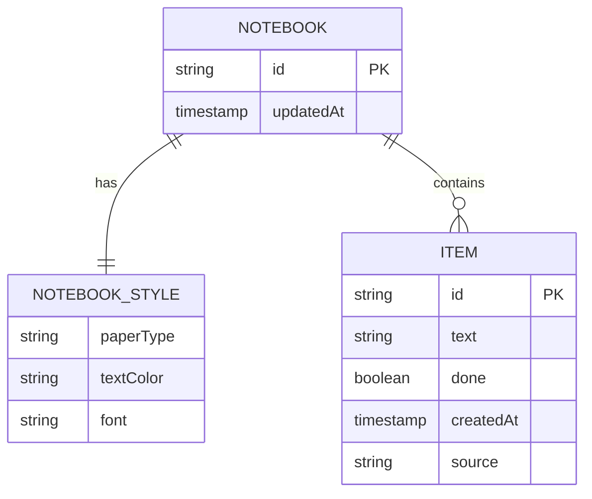

# 4. Data Model and API

Although it is a single schema-less JSON document in Cosmos DB, the logical entities are:



## 4.1 Document Structure (Cosmos DB)
```json
{
  "id": "notebook-default",
  "updatedAt": "2026-07-14T18:32:00Z",
  "style": {
    "paperType": "lined",
    "textColor": "#1a1a1a",
    "font": "handwriting-caveat"
  },
  "items": [
    {
      "id": "item-001",
      "text": "Buy resistor for GT911",
      "done": false,
      "createdAt": "2026-07-14T18:00:00Z",
      "source": "ocr"
    }
  ]
}
```

## 4.2 API Endpoints

| Method | Route | Description |
|---|---|---|
| `GET` | `/notebook` | Returns the complete document |
| `PATCH` | `/notebook/style` | Updates styles |
| `POST` | `/notebook/items` | Creates an item |
| `PATCH` | `/notebook/items/{id}` | Updates text/status |
| `DELETE` | `/notebook/items/{id}` | Removes item |
| `POST` | `/ocr` | Processes writing image |

Every change triggers an event via WebSocket (SignalR).
